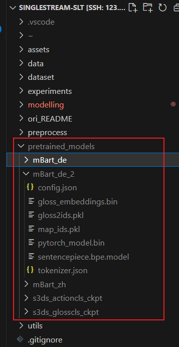
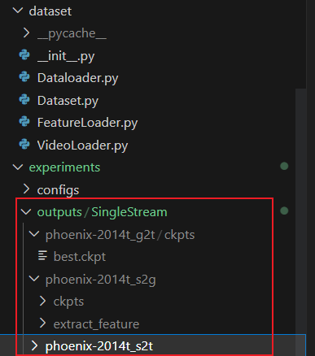
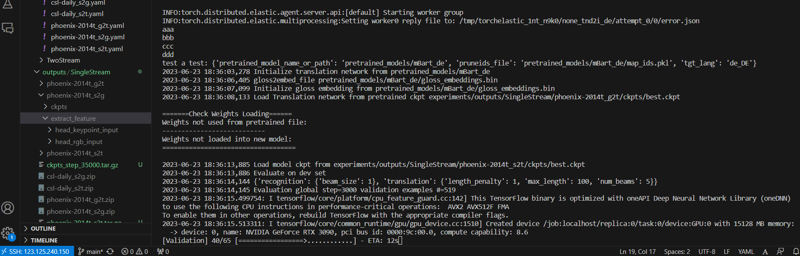
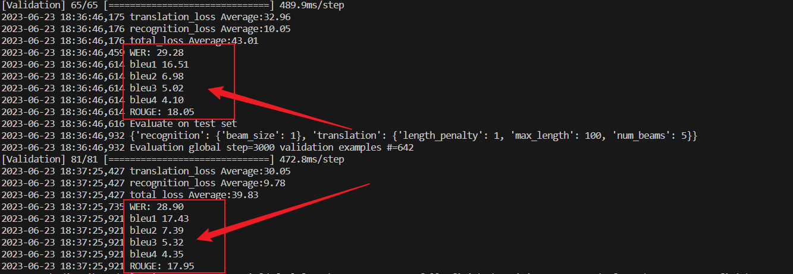
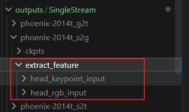
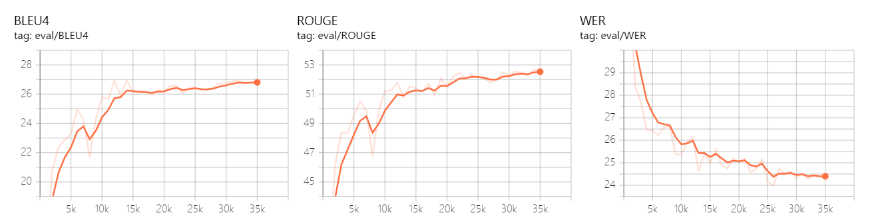
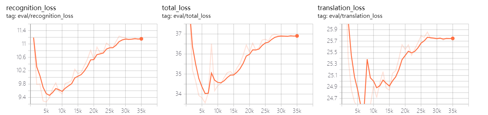
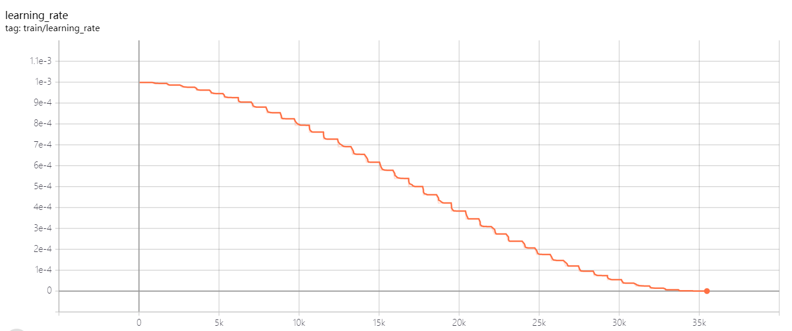
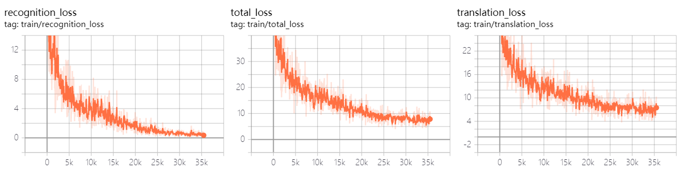

# SingleStream-SLT
论文复现：A Simple Multi-modality Transfer Learning Baseline for Sign Language Translation (SingleStream-SLT Baseline) 

参考原论文的复现代码：https://github.com/FangyunWei/SLRT


## 一、论文个人总结

##### **A Simple Multi-Modality Transfer Learning Baseline for Sign Language Translation** `CVPR2022` [*paper*](https://arxiv.org/pdf/2203.04287.pdf) [*code*](https://github.com/FangyunWei/SLRT)

- 类型：Sign2Gloss + Gloss2Text


- 提出当前的问题：当前主要使用NMT（neural machine translation)的方法但该方法需要大量的数据，但当前手语数据缺少


- 提出的方法 : 在S2G以及G2T两个阶段分别引入其他部分的预训练大模型，再结合手语数据进行进一步训练

<center class="half">
    
    
</center>


- 创新：提出两阶段预训练（Sign2Gloss + Gloss2Text）+map，通过利用可以有效转移到手语翻译的现有数据集和监督，减少了收集大量并行数据的必要性。


- 效果 ：[^1]

  |    Dataset    |   R   |  B1   |  B2   |  B3   |  B4   |                            Model                             |                           Training                           |
  | :-----------: | :---: | :---: | :---: | :---: | :---: | :----------------------------------------------------------: | :----------------------------------------------------------: |
  | Phoenix-2014T | 53.08 | 54.48 | 41.93 | 33.97 | 28.57 | [ckpt](https://hkustconnect-my.sharepoint.com/:f:/g/personal/rzuo_connect_ust_hk/EkpQzXWBrWxDruz6-U-V0kUBgit2vXsc40wLipV8YPLXaQ?e=Bru3oz) | [config](../experiments/configs/SingleStream/phoenix-2014t_s2t.yaml) |
  |   CSL-Daily   | 53.35 | 53.53 | 40.68 | 31.04 | 24.09 | [ckpt](https://hkustconnect-my.sharepoint.com/:f:/g/personal/rzuo_connect_ust_hk/EudFBd-IzWJOngYdXVxox6kBI7ASATileGu8ncW-dBDi-w?e=YvKAKm) | [config](../experiments/configs/SingleStream/csl-daily_s2t.yaml) |

[^1]: ‘R’ represents ROUGE, and ‘B1’ denotes BLEU-1, with the same for ‘B2-B4’.


- 相关关联文献：Rethinking Spatiotemporal Feature Learning : Speed-Accuracy Trade-offs in Video Classification `ECCV 2018`（视频分类领域） [*paper*](https://arxiv.org/pdf/1712.04851.pdf) 

  - 提出了S3D模型（用一些2D卷积替换掉原来的3D卷积），采用连续的每个3D卷积替换为两个连续的卷积层：一个2D卷积层用于学习空间特征，然后是一个仅在时间轴上的1D卷积层

  - 效果：压缩模型大小和提高处理速度的同时，还能提高准确性

  - 输入：视频帧——输出：特征的分类标签
  - 在A Simple Multi-modality Transfer Learning Baseline for Sign Language Translation中，用来将T × 224 × 224 × 3的图像帧转为预测的gloss特征的分类


## 二、网络具体流程整理

#### 1、Visual Encoder Network

##### 输入输出：

​	视频流 => 预测的gloss序列


##### 模型结构与流程：

- input：视频流      **output：帧数据T × 224 × 224 × 3** （T是视频帧数）

- => **S3D模型**           **output:  T/4×832的特征矩阵** [^2] ( 其中832是特征的维度,由预训练好的S3D模型决定)


[^2]:T/4 ： 这个值出现的原因是S3D模型只使用了前四个块。S3D模型是一个3D卷积神经网络，它的设计目标是从视频中提取空间和时间特征。在这个模型中，每一层或者说每一个块都会对输入数据进行一定的下采样，也就是降低数据的分辨率。在这篇文章的模型中，作者只使用了S3D模型的前四个块，这意味着输入数据被下采样了四次。因此，原始的帧数T被降低到了T/4。

- => **投影块（Projection Block）**一个时间线性层，一个批量归一化层BN和一个ReLU层    **output: ？**

- =>**时间卷积块（Temporal Convolutional Block）** 两个时间卷积层，一个线性转换层和一个ReLU层    **output: 词汇表示"（gloss representation），其大小为T/4×512，这个表示在高维空间中代表了手势类别。**（512为特征的维度）

- =>**一个线性分类器MLP和一个Softmax函数**   **output: T/4×K，其中K是词汇表的大小。这个词汇概率表示了每一帧对应的手势类别的概率**(gloss类别)

- =>**CTC decoding**  [^3]    **output:生成预测的gloss序列**

[^3]: CTC loss : CTC本质上只是一个损失函数，这个损失函数约束神经网络训练出CTC所描述的序列属性（blank分割），就如同softmax约束神经网络训练出的分类属性。在softmax分类问题中解码就是简单的取概率最大的类，但是CTC训练出的序列模型解码就相对复杂多了，有best path ,beam search ,前缀树搜索，还有苗亚杰提出的通过wfst语言模型约束的best path解码等。


##### 原有论文模型图：


#### 2、Visual-Language Mapper

##### 输入输出：

​	? => ?	


##### 模型结构与流程：

- 具有两个隐藏层的全连接 MLP


#### 3、Translation Network

##### 输入输出：

​	gloss sequences =>spoken language texts


##### 模型结构与流程：

- 利用了mBART预训练模型

  


## 三、复现过程

#### 0、目录结构

- 数据集位于data目录下
- 配置文件位于experiments/configs目录下
- 模型和其他重要的模块（如数据加载器、预处理脚本等）位于modelling和dataset目录下
- 训练脚本（training.py）位于项目根目录下


#### 1、代码

```powershell
git clone https://github.com/qbdl/SingleStream-SLT.git
```


#### 2、下载数据集，这里以phoenix-2014t为例：

```powershell
wget https://www-i6.informatik.rwth-aachen.de/ftp/pub/rwth-phoenix/2016/phoenix-2014-T.v3.tar.gz -O data/phoenix-2014t/phoenix-2014-T.v3.tar.gz

tar -xvf data/phoenix-2014t/phoenix-2014-T.v3.tar.gz data/phoenix-2014t/ #可能会失败，可以进入目录后解压

#之后需要压缩成一个zip文件，但由于文件同名问题，没有成功压缩，所以后续都是用原有论文提供的特征提取后的数据文件
# zip -r -j data/phoenix-2014t/phoenix-2014t-videos.zip data/phoenix-2014t/phoenix-2014t.v3/PHOENIX-2014-T/features/fullFrame-210x260px/
```


#### 3、下载预训练模型，创建并放在pretrained_models文件夹下：

下载路径： [here](https://hkustconnect-my.sharepoint.com/:f:/g/personal/rzuo_connect_ust_hk/EolDU7j15xROncGg8QqLpkABn9mFEfriS0owcyr048nyXg?e=jHdxlg)

文件夹结构如下：




#### 4、创建虚拟环境并安装依赖

租GPU时环境选择torch=1.9.0，由于原来的environment.yaml创建总是报错，于是我分开了conda与pip并修改并增加了部分包使其可兼容。


创建虚拟环境并安装一部分依赖

```powershell
conda env create -f environment.yml
conda activate slt
```

剩余部分依赖

```powershell
pip install -r requirements.txt
```

解决版本不兼容

```powershell
#为了解决版本不兼容的问题——在环境slt中执行下述操作
pip install torch==1.9.0+cu111 torchvision==0.10.0+cu111 torchaudio==0.9.0 -f https://download.pytorch.org/whl/torch_stable.html 
```

测试各版本：

```
python test_version.py
```


#### 5、先进行测试Evaluation试试效果

- 下载并放置[checkpoint文件](https://hkustconnect-my.sharepoint.com/:f:/g/personal/rzuo_connect_ust_hk/EkpQzXWBrWxDruz6-U-V0kUBgit2vXsc40wLipV8YPLXaQ?e=Bru3oz)：这里以phoenix-2014t为例

**解压后路径如下：**



​		.ckpt : 全称为CheckPoint(检查点),完整模型的常见格式

- 执行下面代码，运行Sign2Text测试


```powershell
dataset=phoenix-2014t #phoenix-2014t / csl-daily

python -m torch.distributed.launch --nproc_per_node 1 --use_env prediction.py --config experiments/configs/SingleStream/${dataset}_s2t.yaml
```

​	代码含义解释

```powershell
python -m torch.distributed.launch #这个命令用来启动 PyTorch 的分布式框架。 -m 标志表示以模块方式运行接下来的代码。

--nproc_per_node 1 #这个标志表示在每个节点（即每个机器）上启动1个进程。这意味着你的机器有1个GPU设备，每个设备运行一个进程。

--use_env #告诉launch工具使用当前的环境变量来设置进程的环境。这对于确保所有进程都使用相同的Python环境、库版本等非常有用。

prediction.py #测试的Python文件

--config experiments/configs/SingleStream/${dataset}_s2t.yaml #这个是你的测试脚本的参数，表示用哪个配置文件来设置测试。${dataset} 是一个环境变量，表示数据集的名字（如phoenix-2014t或csl-daily），s2t是选择的任务的模式（还有s2g,g2t等）
```

如果不适用并行，则修改为：

```powershell
dataset=phoenix-2014t #phoenix-2014t / csl-daily
python prediction.py --config experiments/configs/SingleStream/${dataset}_s2t.yaml
```

测试运行结果：






#### 6、自己训练:

##### Pretraining:

​	Sign2Gloss部分pretraining：

```powershell
dataset=phoenix-2014t #phoenix-2014t / csl-daily
python -m torch.distributed.launch --nproc_per_node 8  --use_env training.py --config experiments/configs/SingleStream/${dataset}_s2g.yaml 
```

​	Gloss2Text部分pretraining：

```powershell
dataset=phoenix-2014t #phoenix-2014t / csl-daily
python -m torch.distributed.launch --nproc_per_node 8  --use_env training.py --config experiments/configs/SingleStream/${dataset}_g2t.yaml
```

这里跳过了预训练，直接拿原论文训练好的模型(s2g以及g2t) [here](https://hkustconnect-my.sharepoint.com/:f:/g/personal/rzuo_connect_ust_hk/EuJlnAhX7h9NnvFZhQH-_fcBtV8lbnj2CphiuidhhcU69w?e=eOsQ4B).（原论文没有提供csl-daily的g2t文件,需要自己运行获得），**放置路径同测试部分**。


##### Feature Extract:

使用s3D进行视频特征提取

```powershell
dataset=phoenix-2014t #phoenix-2014t / csl-daily
python -m torch.distributed.launch --nproc_per_node 8 --use_env extract_feature.py --config experiments/configs/SingleStream/${dataset}_s2g.yaml
```

特征提取这里也跳过了，采用原论文提取好的特征，上一步已经存在路径下了，不需要额外操作。




##### Multi-modal Joint Training:

```powershell
dataset=phoenix-2014t #phoenix-2014t / csl-daily
python -m torch.distributed.launch --nproc_per_node 1 --use_env training.py --config experiments/configs/SingleStream/${dataset}_s2t.yaml
```

这里可以直接运行，下面是自己运行phoenix-2014t的过程与结果，具体日志以及tensorboard文件见仓库`s2t训练过程与日志.zip`。










## 补充：

#### prediction.py的使用过程：

使用`build_model()` 函数来构建模型

- `build_model()`中使用了 `cfg` 参数来配置模型的各个部分并创建了一个 `SignLanguageModel` 对象    （ `modelling/model.py` 文件）

  - `SignLanguageModel` 对象  （`modelling/model.py`文件）  包含了两个子网络，分别是 `RecognitionNetwork` 和 `TranslationNetwork`

    - `TranslationNetwork` 对象的构造函数中，调用 `load_from_pretrained_ckpt()` 函数来加载预训练的模型参数。这个函数会使用 `pretrained_ckpt` 参数来指定预训练模型的路径，并使用 `torch.load()` 函数来加载模型参数。加载完成后，它会将参数赋值给 `TranslationNetwork` 对象的状态字典中。  （`modelling/translation.py`文件)

    - `RecognitionNetwork` 对象会根据配置文件 `cfg` 来初始化各个模块，例如 `Conv3d`、`MaxPool3d`、`Linear` 等。这些模块将被用于构建视频流网络的各个层。它会将视频流输入到网络中进行处理，以提取视频特征向量。具体来说，视频流会经过 `Conv3d`、`MaxPool3d`、`Linear` 等模块的处理，最终输出一个视频特征向量。这个视频特征向量将被用于后续的分类任务。( `modelling/recognition.py` 文件)

      

#### argparse库的使用：

```python
if __name__ == "__main__":
    parser = argparse.ArgumentParser("SLT baseline Testing") #创建了一个ArgumentParser对象，这个对象包含将命令行解析成Python数据类型所需要的全部信息。传入的字符串"SLT baseline Testing"会在使用-h参数时作为程序的描述文字显示。
    parser.add_argument(
        "--config",
        default="configs/default.yaml",
        type=str,
        help="Training configuration file (yaml).",
    )
    parser.add_argument(
        "--save_subdir",
        default='prediction',
        type=str
    )
    parser.add_argument(
        '--ckpt_name',
        default='best.ckpt',
        type=str
    )
    #parser.add_argument：这个方法用来指定程序能够接受的命令行选项。在这里添加了三个命令行参数：
		#--config：配置文件路径，默认值为configs/default.yaml。
		#--save_subdir：保存子目录的名称，默认值为prediction。
		#--ckpt_name：检查点文件的名称，默认值为best.ckpt。
	#每个参数后面都可以通过在运行程序的命令行命令后面加上相应的参数及其值来进行指定。例如：python your_program.py --config myconfig.yaml。
    args = parser.parse_args()
	#解析命令行参数，返回一个namespace，将命令行参数转换为属性。在上面的代码中，这个namespace被命名为args，那么你可以通过args.config，args.save_subdir，args.ckpt_name来分别获取这三个参数。
```

在命令行/终端输入下面指令来运行该文件：

```powershell
python your_program.py --config "my_config.yaml" --save_subdir "my_prediction" --ckpt_name "my_best.ckpt"
#向其传入三个参数config、save_subdir和ckpt_name，对应的值分别为my_config.yaml、my_prediction和my_best.ckpt。
```

如果不提供这些参数，那么程序会使用默认值。例如，如果你只运行python your_program.py，那么参数的值会是configs/default.yaml、prediction和best.ckpt。


#### 环境管理 env：

env export

```powershell
conda env export > environment.yml
#将当前conda环境中的所有依赖项（包括名称、版本、依赖项等）导出到一个名为environment.yml的文件中。这个文件可以用于在另一个环境中创建相同的环境，也可以用于备份当前环境的状态。
```

env create

```powershell
conda env create -f environment.yml
#conda env create命令用于创建一个新的conda环境，其中包含了指定的环境文件中列出的所有依赖项
#-f选项用于指定要使用的环境文件。
```

activate 

```powershell
conda activate slt #用于激活环境（slt可以改为对应yml里写的环境名)
```

deactivate

```powershell
conda deactivate #退出虚拟环境
```

env remove

```powershell
conda env remove -n slt #删除虚拟环境（slt可以换成其他的环境名）
```


#### VSCode debug中launch.json文件配置

带命令行参数debug的json文件：

**原始powershell命令**:

```powershell
python -m torch.distributed.launch --nprocer_node 1 --use_env prediction.py --config experiments/configs/SingleStream/phoenix-2014t_s2t.yaml
```

**对应launch.json文件**：

```json
{
    "version": "0.2.0",
    "configurations": [
        //对应带命令行的debug
        {
            "name": "Python: Current File",
            "type": "python",
            "request": "launch",
            "console": "integratedTerminal",
            "module": "torch.distributed.launch",
            "args": ["--nproc_per_node", "1", "--use_env", "prediction.py", "--config", "experiments/configs/SingleStream/phoenix-2014t_s2t.yaml"],
            // "cwd": "${workspaceFolder}",
            "justMyCode": true
        },
        //对应不带命令行的debug
        {
            "name": "Python: Current File",
            "type": "python",
            "request": "launch",
            "program": "${file}",
            "console": "integratedTerminal",
            "justMyCode": true
        }
    ]
}
```


#### 其他小知识

查找虚拟环境site-packages位置：

```powershell
find / -name 'site-packages'
```

释放显存：

```
ps -ef 

找到对应进程的id

kill id
```

安装zip:

```powershell
sudo apt-get update
apt-get install zip
```

tar常见参数选项：

```
tar命令是Linux/Unix系统中的一种归档工具，用于创建、解压和管理tar文件。以下是一些常用的tar命令选项：

-c: 创建一个新的归档文件。例如：tar -cvf archive.tar file1 file2 将file1和file2归档到archive.tar文件中。

-x: 从一个归档文件中提取文件。例如：tar -xvf archive.tar 将从archive.tar中解压所有文件。

-f: 允许你指定归档文件的名称。它通常与-c或-x一起使用。例如：tar -cf archive.tar file1 将file1归档到archive.tar。

-v: 显示详细信息，也就是"verbose"模式。在创建或解压归档文件时，它将列出正在处理的每个文件的名称。
```

