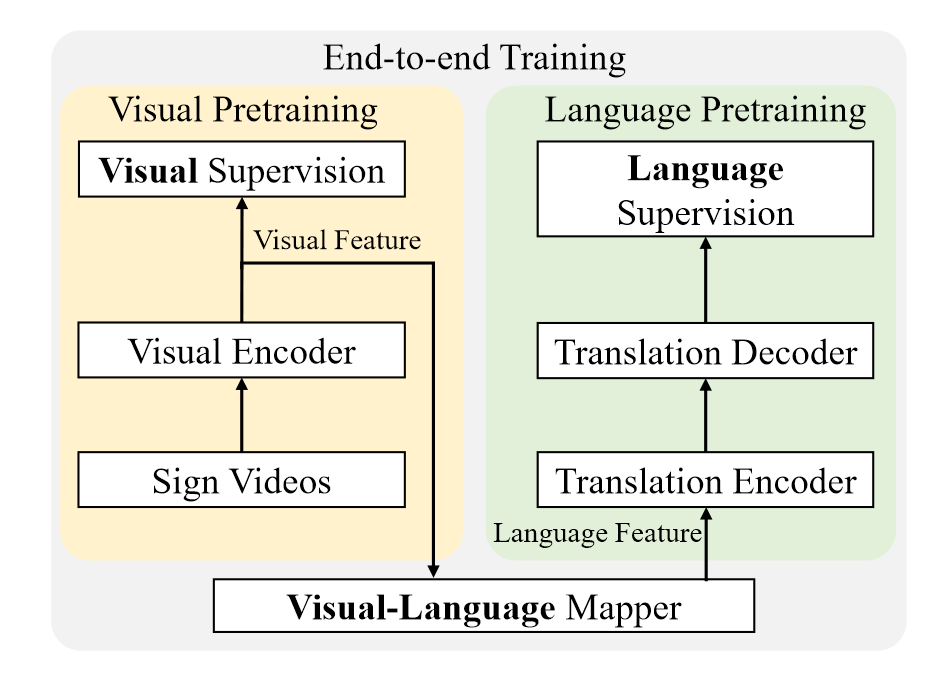
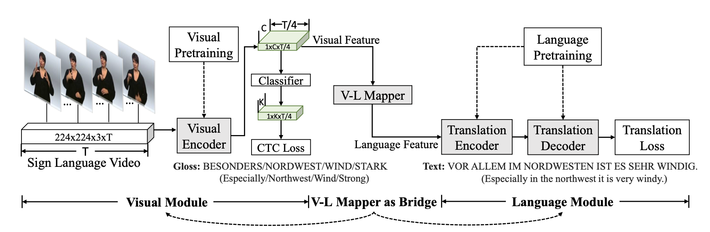
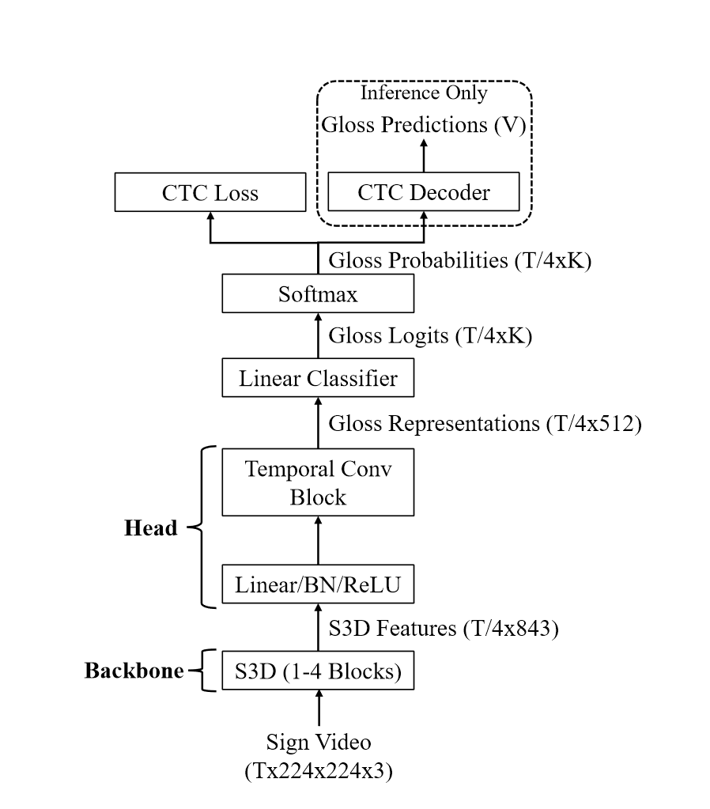

# SingleStream-SLT
论文复现：A Simple Multi-modality Transfer Learning Baseline for Sign Language Translation (SingleStream-SLT Baseline) 

参考原论文的复现代码：https://github.com/FangyunWei/SLRT

## 一、论文个人总结

##### **A Simple Multi-Modality Transfer Learning Baseline for Sign Language Translation** `CVPR2022` [*paper*](https://arxiv.org/pdf/2203.04287.pdf) [*code*](https://github.com/FangyunWei/SLRT)

- 类型：Sign2Gloss + Gloss2Text

- 提出当前的问题：当前使用NMT（neural machine translation)的方法但该方法需要大量的数据，而当前手语数据缺少

- 提出的方法 : 引入其他部分更通用的数据集一起训练

    
    

- 创新：提出两阶段预训练（Sign2Gloss + Gloss2Text）+map，通过利用可以有效转移到手语翻译的现有数据集和监督，减少了收集大量并行数据的必要性。

- 效果 ：[^1]

  |    Dataset    |   R   |  B1   |  B2   |  B3   |  B4   |                            Model                             |                           Training                           |
  | :-----------: | :---: | :---: | :---: | :---: | :---: | :----------------------------------------------------------: | :----------------------------------------------------------: |
  | Phoenix-2014T | 53.08 | 54.48 | 41.93 | 33.97 | 28.57 | [ckpt](https://hkustconnect-my.sharepoint.com/:f:/g/personal/rzuo_connect_ust_hk/EkpQzXWBrWxDruz6-U-V0kUBgit2vXsc40wLipV8YPLXaQ?e=Bru3oz) | [config](../experiments/configs/SingleStream/phoenix-2014t_s2t.yaml) |
  |   CSL-Daily   | 53.35 | 53.53 | 40.68 | 31.04 | 24.09 | [ckpt](https://hkustconnect-my.sharepoint.com/:f:/g/personal/rzuo_connect_ust_hk/EudFBd-IzWJOngYdXVxox6kBI7ASATileGu8ncW-dBDi-w?e=YvKAKm) | [config](../experiments/configs/SingleStream/csl-daily_s2t.yaml) |

[^1]: ‘R’ represents ROUGE, and ‘B1’ denotes BLEU-1, with the same for ‘B2-B4’.

- 相关关联文献：**Rethinking Spatiotemporal Feature Learning : Speed-Accuracy Trade-offs in Video Classification** `ECCV 2018`（视频分类领域） [*paper*](https://arxiv.org/pdf/1712.04851.pdf) 

  - 提出了S3D模型（用一些2D卷积替换掉原来的3D卷积），采用连续的每个3D卷积替换为两个连续的卷积层：一个2D卷积层用于学习空间特征，然后是一个仅在时间轴上的1D卷积层

  - 效果：压缩模型大小和提高处理速度的同时，还能提高准确性

  - 输入：视频帧——输出：特征的分类标签
  - 在A Simple Multi-modality Transfer Learning Baseline for Sign Language Translation中，用来将**T × 224 × 224 × 3的图像帧转为预测的gloss特征的分类**

## 二、网络具体流程整理

#### 1、Visual Encoder Network

##### 输入输出：

​	视频流 => 预测的gloss序列

##### 模型结构与流程：

- input：视频流      **output：帧数据T × 224 × 224 × 3** （T是视频帧数）

- => **S3D模型**           **output:  T/4×832的特征矩阵** [^2] ( 其中832是特征的维度,由预训练好的S3D模型决定)

[^2]:T/4 ： 这个值出现的原因是S3D模型只使用了前四个块。S3D模型是一个3D卷积神经网络，它的设计目标是从视频中提取空间和时间特征。在这个模型中，每一层或者说每一个块都会对输入数据进行一定的下采样，也就是降低数据的分辨率。在这篇文章的模型中，作者只使用了S3D模型的前四个块，这意味着输入数据被下采样了四次。因此，原始的帧数T被降低到了T/4。

- => **投影块（Projection Block）**一个时间线性层，一个批量归一化层BN和一个ReLU层    **output: ？**

- =>**时间卷积块（Temporal Convolutional Block）** 两个时间卷积层，一个线性转换层和一个ReLU层    **output: 词汇表示"（gloss representation），其大小为T/4×512，这个表示在高维空间中代表了手势类别。**（512为特征的维度）

- =>**一个线性分类器MLP和一个Softmax函数**   **output: T/4×K，其中K是词汇表的大小。这个词汇概率表示了每一帧对应的手势类别的概率**(gloss类别)

- =>**CTC decoding**  [^3]    **output:生成预测的gloss序列**

[^3]: CTC loss : CTC本质上只是一个损失函数，这个损失函数约束神经网络训练出CTC所描述的序列属性（blank分割），就如同softmax约束神经网络训练出的分类属性。在softmax分类问题中解码就是简单的取概率最大的类，但是CTC训练出的序列模型解码就相对复杂多了，有best path ,beam search ,前缀树搜索，还有苗亚杰提出的通过wfst语言模型约束的best path解码等。

##### 原有论文模型图：

#### 2、Visual-Language Mapper

##### 输入输出：

​	? => ?	

##### 模型结构与流程：

- 具有两个隐藏层的全连接 MLP

#### 3、Translation Network

##### 输入输出：

​	gloss sequences =>spoken language texts

##### 模型结构与流程：

- 利用了mBART预训练模型

  

## 三、复现过程

